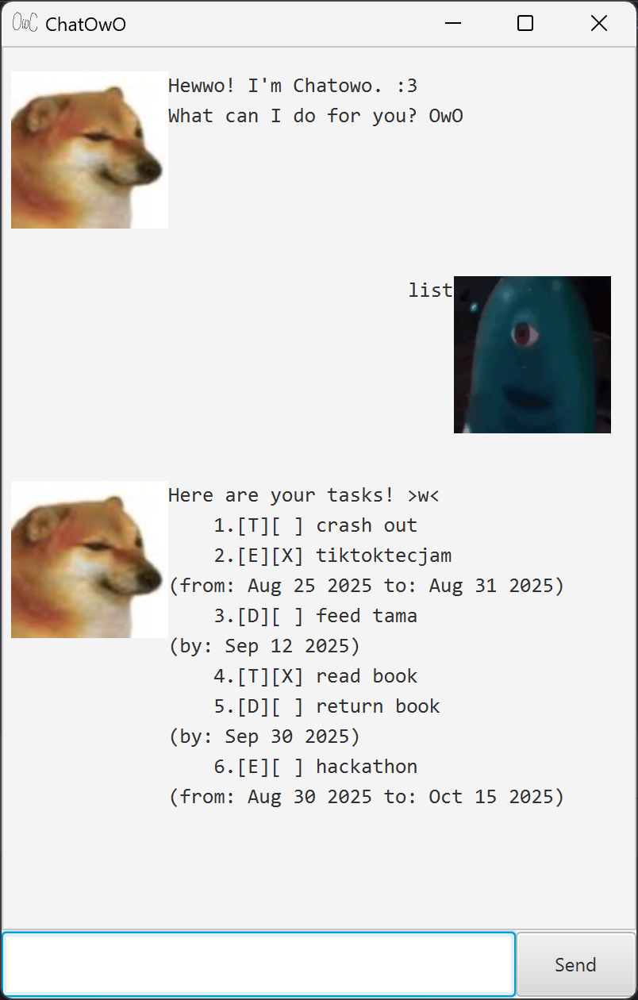

# Chatowo User Guide



Chatowo is your trusty little task manager chatbot.  
You can install your own Chatowo [over here](https://github.com/t-yunqi/ip/releases).  
Use this guide to fully understand Chatowo's features!

## View task list  
Shows your task list.

**Format:** `list`

Glossary:  
`[T]` = Todo task  
`[D]` = Deadline task  
`[E]` = Event task  
`[X]` = Completed task  
`[ ]` = Incomplete task  

## Add todo task
Adds a simple todo task to your task list.  

**Format:** `todo [task]`

**Examples:** 
```
todo eat lunch  
todo read book
```

## Add deadline task  
Adds a task with a deadline to your task list.  
Use this for tasks to be done by a certain date.

**Format:** `deadline [task] /by YYYY-MM-DD`  

**Examples:**
```
deadline homework /by 2025-01-01
deadline project deliverables /by 2025-12-30
```

## Add event task  
Adds a task with to and from dates to your task list.  
Use this to keep track of events alongside your tasks.

**Format:** `event [task] /from YYYY-MM-DD /to YYYY-MM-DD`

**Examples:**
```
event hackathon /from 2025-01-01 /to 2025-02-01
event film festival /from 2025-06-01 /to 2025-07-01
```

## Delete task
Deletes the specified task from your task list.

**Format:** `delete [index]`  
**Example:** `delete 2`  
Use `list` to find the task's index before using `delete`.

## Mark task as complete
Marks the specified task from your task list.

**Format:** `mark [index]`  
**Example:** `mark 2`  
Use `list` to find the task's index before using `delete`.


## Unmark task
Unmarks the specified task from your task list.

**Format:** `unmark [index]`  
**Example:** `unmark 2`  
Use `list` to find the task's index before using `delete`.

## Find tasks
Finds tasks that contain the specified phrase in the task name.  

**Format:** `find [phrase]`

**Examples:**
```
find homework
find a
```

## Undo latest command
Undoes the last command executed.

**Format:** `undo`

## Close application
Closes your Chatowo window.

**Format:** `bye`